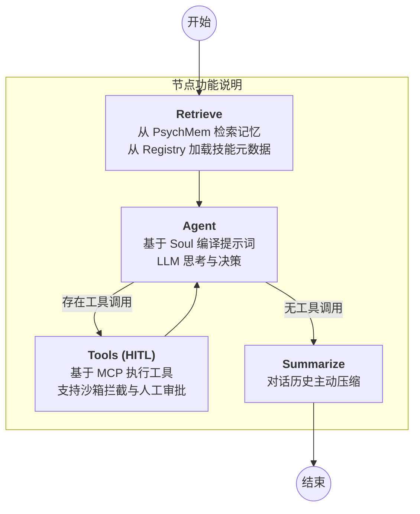

# 通用 AI Agent 框架 (Universal AI Agent Framework)

这是一个基于 LangGraph 构建的高泛化性、企业级通用 AI Agent 框架。它通过解耦底层状态编排与上层业务逻辑，实现了智能体的快速实例化、持久化执行和可靠的自动化工作流。

## 🚀 核心特性

- **基于 LangGraph 的状态机编排**: 将智能体工作流建模为有状态图，支持复杂逻辑循环、自适应跳转和流式输出。
- **规格定义层 (Soul)**: 使用 `soul.md` 声明式定义智能体的角色 (Role)、目标 (Goal) 和行为边界 (Guardrails)。
- **渐进式技能加载 (Skills)**: 支持标准化 `SKILL.md` 技能包，采用按需加载机制，极大地节省 Token 开销并避免逻辑干扰。
- **双层记忆系统**:
    - **短期工作记忆**: 线程级状态持久化 (Checkpointer)，支持断点续传和“时间旅行”调试。
    - **长效认知记忆 (PsychMem)**: 基于心理学机制隔离情景记忆与语义记忆，防止关键准则被遗忘。
- **工具接入网关 (MCP)**: 集成模型上下文协议 (Model Context Protocol)，统一接入本地脚本、数据库及第三方 API。
- **安全与治理**: 内置执行沙箱模拟、主动上下文压缩 (Auto Compact) 以及人在回路 (HITL) 拦截审批机制。

## 🏗️ 技术架构与运行原理

### 1. 核心运行时 (Runtime)
框架底层基于 **LangGraph** 的 `StateGraph` 构建，其核心运行逻辑如下：



具体包含以下节点：
- **Retrieve 节点**: 负责从 `PsychMem` 检索相关记忆，并从 `SkillRegistry` 获取当前可用的技能列表，更新 `AgentState` 的上下文视图。
- **Agent 节点**: 根据 `Soul` 编译出的系统提示词、当前上下文及对话历史进行决策。若 LLM 生成工具调用请求，则流转至 `Tools` 节点。
- **Tools 节点**: 基于 **MCP 协议** 执行工具，所有工具调用均被封装在 `sandbox_exec` 拦截器中，模拟沙箱执行环境。
- **Summarize 节点**: 当会话长度超过预设阈值时，自动调用 `summarize_history` 压缩历史记录，实现“主动压缩”管线。

### 2. 状态管理 (State Management)
使用强类型的 `AgentState` (基于 `TypedDict`) 贯穿整个图生命周期：
- `messages`: 采用 `Annotated[List, add_messages]`，确保消息流的追加与工具返回值的正确关联。
- `context`: 动态编译的上下文空间，用于存放检索到的记忆和技能元数据。
- `summary`: 存放历史摘要，辅助模型在长周期任务中保持连贯。

### 3. 认知记忆系统 (PsychMem)
实现了基于认知心理学原理的双轨存储：
- **情景记忆 (Episodic)**: 记录具体执行轨迹，带时间戳，模拟遗忘曲线。
- **语义记忆 (Semantic)**: 存储永久性的架构决策、开发规范和边界规则，确保模型不因多轮对话而淡忘“底线”。

### 4. 渐进式技能披露 (Progressive Disclosure)
技能管理遵循“按需挂载”原则：
- **索引阶段**: 系统仅加载 `SKILL.md` 的 YAML 元数据（名称、描述、参数定义），构建轻量级提示词。
- **加载阶段**: 只有当模型确定需要某项技能时，才将数百行的 Markdown 正文（执行步骤、示例、约束）注入当前工作记忆，极大降低了背景噪音和 Token 损耗。

## 📂 项目结构

```text
agent_framework/
├── core/                # 核心运行时，包含状态定义 (state.py)、节点逻辑 (workflow.py) 和图构建 (graph.py)
├── soul/                # Soul 引擎，负责解析身份规格 (loader.py) 与 Pydantic 模型 (models.py)
├── skills/              # 技能引擎，负责管理 (registry.py) 和技能数据模型 (models.py)
├── memory/              # 记忆系统，包含短期持久化 (short_term.py)、长效存储 (long_term.py) 和认知对齐 (psych_mem.py)
├── mcp/                 # 工具网关，包含 MCP 客户端 (client.py) 与工具节点封装 (tool_node.py)
└── tools/               # 基础工具实现与本地注册表 (registry.py)
examples/                # 示例配置 (Research Assistant 等)
run_agent.py             # 框架功能验证入口脚本
chat_with_agent.py       # 交互式对话演示脚本
```

## 🛠️ 快速开始

### 1. 安装依赖

确保已安装 Python 3.9+，然后运行：

```bash
pip install -e .
# 或者手动安装核心依赖
pip install langgraph langchain pydantic mcp ruamel.yaml langchain-openai langchain-community
```

### 2. 配置智能体

在 `examples/` 目录下参考现有模板：
- **定义身份**: 编辑 `soul.md` 设置角色和目标。
- **添加技能**: 在 `skills/` 目录下创建 `SKILL.md` 文件。

### 3. 运行示例

执行以下脚本启动演示智能体：

```bash
python run_agent.py
```

或者使用交互式对话模式（支持用户自定义 API 参数）：

```bash
python chat_with_agent.py
```

## 🛡️ 安全治理
框架支持在关键工具调用前设置 `interrupt_before=["tools"]`，实现“人在回路”审批。当检测到敏感操作时，图执行会挂起，等待人类操作员查阅当前快照状态并批准后方可继续执行。
